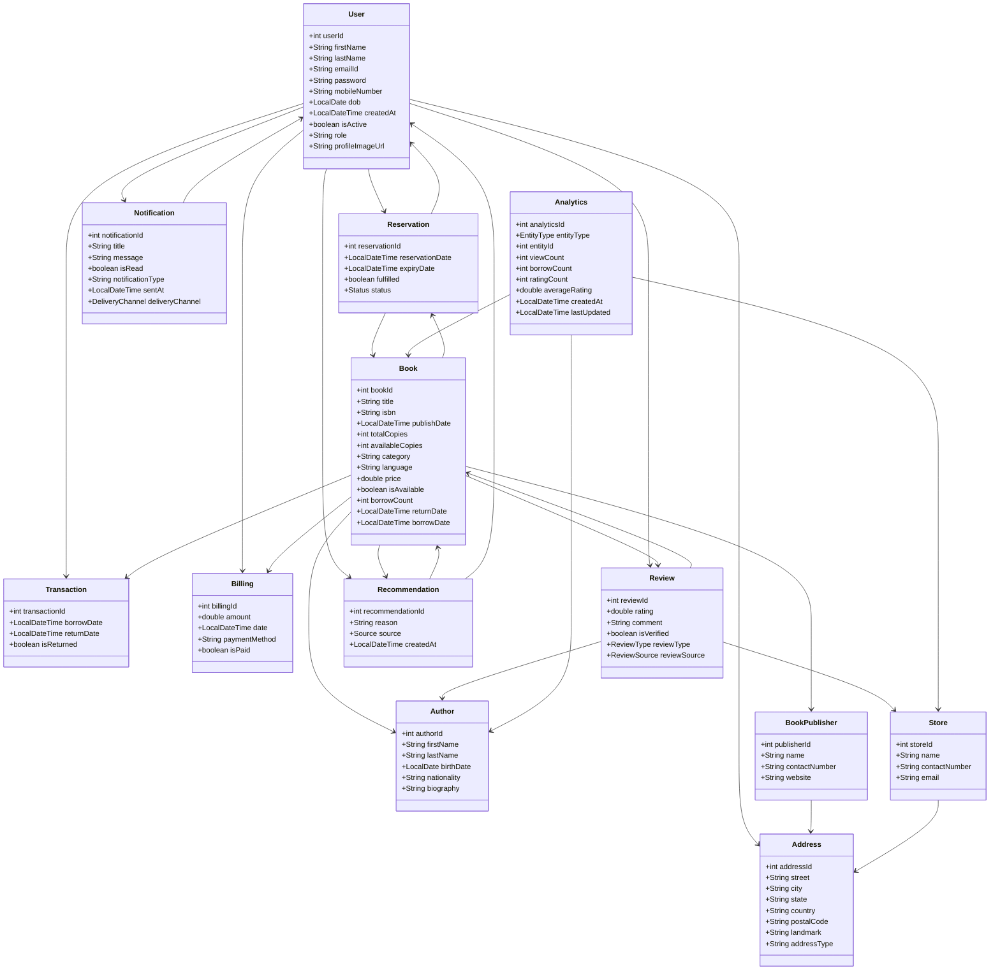

# 📚 Library Management System (LMS)

A robust, full-featured **Library Management System** built with **Spring Boot**, **MySQL**, and **Hibernate**. It supports complete management of books, users, authors, publishers, transactions, billing, reservations, recommendations, and more—implemented using a clean layered architecture and best practices for real-world scalability.

---

## 📌 Table of Contents

* [Overview](#overview)
* [Core Features](#core-features)
* [Advanced Features](#advanced-features)
* [Technology Stack](#technology-stack)
* [System Architecture](#system-architecture)
* [Modules](#modules)
* [Installation & Setup](#installation--setup)
* [API Endpoints](#api-endpoints)
* [Database Schema](#database-schema)
* [Class Diagram](#class-diagram)
* [Best Practices Followed](#best-practices-followed)
* [Future Enhancements](#future-enhancements)
* [Author](#author)
* [License](#license)

---

## 📖 Overview

The **Library Management System** offers an automated backend solution for managing:

* Library users & accounts
* Book borrowing, returning, and availability
* Author and publisher catalogs
* Transactions & overdue billing
* Reservations & notifications
* Book recommendations
* User reviews

It is designed using a modular, maintainable architecture following real-world enterprise standards.

---

## 🚀 Core Features

* 📘 Book CRUD operations
* 👤 User registration & management
* ✍️ Author and publisher management
* 📖 Borrowing, returning, overdue logic
* 💳 Billing and payment tracking
* 📅 Reservation system with status tracking
* 💡 AI/manual-based book recommendations
* ⭐ Review system with verification
* 🔔 Email-based notifications

---

## 🧠 Advanced Features

* 🕵️ Custom **interceptors** for logging request metadata
* 📜 **Filters** to log remote host/IP info
* 🧩 **Global exception handler** using `@ControllerAdvice`
* 🔁 **Scheduled Jobs** (e.g., return reminders, analytics)
* 📊 **Analytics Tracking** (views, ratings, borrows)
* 📨 **EmailService** for notifications and alerts
* 🧪 Clean, testable controller-service-repo architecture
* 🪵 Native **Logback** logging across all layers (no SLF4J)

---

## 🛠️ Technology Stack

| Layer           | Technology       |
| --------------- | ---------------- |
| Language        | Java 21          |
| Framework       | Spring Boot      |
| ORM             | Hibernate (JPA)  |
| Database        | MySQL            |
| Logging         | Logback (native) |
| Build Tool      | Maven            |
| REST Testing    | Postman          |
| Dependency Mgmt | Lombok           |

---

## 🧱 System Architecture

```
Client ➝ Controller ➝ Service ➝ Repository ➝ Database
              ⬑ Filters, Interceptors, AOP
```

---

## 📦 Modules

| Module             | Description                                          |
| ------------------ | ---------------------------------------------------- |
| **User**           | Register, update, search, manage user accounts       |
| **Address**        | Embedded with User or Publisher                      |
| **Book**           | CRUD, availability, borrow/return                    |
| **Author**         | Create authors, link books                           |
| **Publisher**      | Add/edit publisher and their books                   |
| **Transactions**   | Track borrow/return events                           |
| **Billing**        | Charges overdue fees or lost books                   |
| **Reservation**    | Place, update, cancel reservations                   |
| **Recommendation** | AI/manual-based book recommendations                 |
| **Notification**   | Sends emails to users (return, reservation, updates) |
| **Review**         | Users leave reviews (verified by source)             |
| **Analytics**      | View count, rating, borrow count per entity          |
| **Store**          | Physical branch management                           |

---

## 🧰 Installation & Setup

### 🧾 Prerequisites

* Java 21
* Maven
* MySQL Server
* IDE (IntelliJ / Eclipse)
* Postman (for API testing)

### ⚙️ Steps to Run

1. **Clone Repository**

   ```bash
   git clone https://github.com/yourusername/library-management-system.git
   cd library-management-system
   ```

2. **Configure MySQL**

   ```sql
   CREATE DATABASE library_db;
   ```

3. **Update `application.properties`**

   ```properties
   spring.datasource.url=jdbc:mysql://localhost:3306/library_db
   spring.datasource.username=root
   spring.datasource.password=your_password
   spring.jpa.hibernate.ddl-auto=update
   ```

4. **Run Application**

   ```bash
   mvn clean install
   mvn spring-boot:run
   ```

5. **Access API**

   ```
   http://localhost:8080/api/library-management/v1/
   ```

---

## 🔗 API Endpoints

Sample modules and base paths:

| Module         | Endpoint Prefix                              |
| -------------- | -------------------------------------------- |
| User           | `/api/library-management/v1/user`            |
| Book           | `/api/library-management/v1/book`        |
| Author         | `/api/library-management/v1/author`          |
| Publisher      | `/api/library-management/v1/publisher`   |
| Transaction    | `/api/library-management/v1/transaction` |
| Billing        | `/api/library-management/v1/billing`     |
| Review         | `/api/library-management/v1/review`          |
| Reservation    | `/api/library-management/v1/reservation`     |
| Recommendation | `/api/library-management/v1/recommendation`  |
| Notification   | `/api/library-management/v1/notification`    |
| Store          | `/api/library-management/v1/store`       |
| Analytics      | `/api/library-management/v1/analytics`       |

---

## 🗃️ Database Schema

All models are JPA entities with relationships like:

* `User` ↔ `Address` (OneToMany)
* `User` ↔ `Transaction`, `Review`, `Reservation`
* `Book` ↔ `Author`, `Publisher`, `Review`, `Transaction`
* `Recommendation`, `Notification`, and `Billing` all link to `User` and/or `Book`

ORM annotations used: `@Entity`, `@ManyToOne`, `@OneToMany`, `@Enumerated`, `@CreationTimestamp`, etc.

---

## 📊 Class Diagram



---

## ✅ Best Practices Followed

* Modular MVC structure (Controller, Service, Repository)
* Global exception handling via `@ControllerAdvice`
* Native Logback logger usage (not via SLF4J)
* Enumerations for type-safe status and role fields
* Use of `@PrePersist`, `@CreationTimestamp`, and JPA lifecycle annotations
* Clean domain modeling using relationships and cascade rules

---

## 🚧 Future Enhancements

* JWT-based Spring Security
* Swagger/OpenAPI documentation
* Admin dashboard and reporting tools
* Unit and integration tests (JUnit/Mockito)
* Dockerization & CI/CD setup

---

## 👤 Author

**Sidhhant Bhore**
Java Backend Developer
[LinkedIn](https://www.linkedin.com/in/siddhantbhore4645/) | [GitHub](https://github.com/codwithsid)

---

## 📝 License

This project is licensed under the MIT License.
